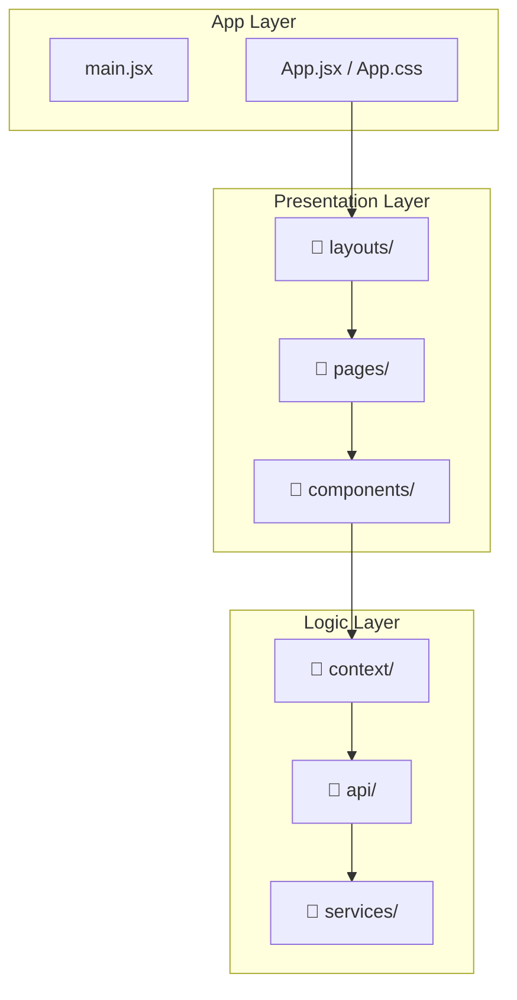
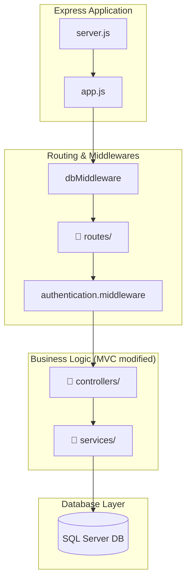
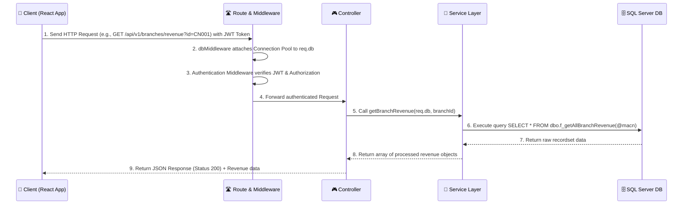

# PetCareX Pet Care Center Management System - Architecture Specification Document

## 📋 Project Overview

**PetCareX** is a modern management system for pet care center chains, where each branch provides clinical examination services, vaccination, and a pet food/accessories store.

The project was developed to gain a deeper understanding of how database management systems operate and how to design optimal query improvement solutions.

The project is built on a **Client-Server** architecture with a complete separation between the Frontend (Vite + React) and Backend (Node.js + Express) communicating via RESTful API endpoints, connecting to a **SQL Server (MSSQL)** relational database management system to ensure data integrity and process complex business logic using Triggers, Functions, and Stored Procedures.

---

## 🏗️ Overall System Architecture

```
┌─────────────────────────────────────────────────────────────┐
│                  CLIENT (FRONTEND)                          │
│   • React 19 + Vite                                         │
│   • TailwindCSS v4 + Ant Design (antd)                      │
│   • Multi-role Portal (Authorization)                       │
└──────────────────────┬──────────────────────────────────────┘
                       │
                       │ HTTP / REST API (Bearer JWT Auth)
                       │
┌──────────────────────▼──────────────────────────────────────┐
│                  SERVER (BACKEND)                           │
│   • Node.js + Express.js 5                                  │
│   • Express Middleware (dbMiddleware, Authentication)       │
└──────────────────────┬──────────────────────────────────────┘
                       │
                       │ Connection Pool (mssql / msnodesqlv8)
                       │
┌──────────────────────▼──────────────────────────────────────┐
│                   DATABASE (MSSQL)                          │
│   • SQL Server Database Engine                              │
│   • Relational Database with Full Constraints (PK, FK, CK)  │
│   • Business Triggers, TVFs & Stored Procedures            │
└─────────────────────────────────────────────────────────────┘
```

---

## 🎨 Frontend Architecture

### Tech Stack

- **Build Tool**: Vite
- **UI Framework**: React 19
- **Routing**: React Router DOM v7 (with role-based routing `ProtectedRoute` based on `allowedRoles`)
- **Styling**: TailwindCSS v4 + Ant Design (`antd`) as the primary component library
- **State Management**: React Context API (`AuthContext` for login session and role management, `CartContext` for managing the Customer's shopping cart)
- **Data Visualization**: Recharts (for revenue report charts and doctor shift statistics)
- **API Client**: Custom Fetch API wrapper (`src/api/client.js`) with automatic Authorization Bearer Token header integration.

### Frontend Directory Structure



```
frontend/
├── src/
│   ├── api/                     # API endpoint definitions
│   │   ├── client.js            # Custom Fetch API Client (with Bearer Token)
│   │   ├── authApi.js           # Login/Registration API
│   │   ├── bookingApi.ts        # Appointment Booking API
│   │   ├── cartApi.ts           # Cart API
│   │   ├── customerApi.ts       # Customer API
│   │   ├── doctor.js            # Doctor-specific API
│   │   ├── invoiceApi.ts        # Invoice API
│   │   ├── petApi.ts            # Pet API
│   │   ├── productApi.ts        # Product API
│   │   ├── receptionAPI.ts      # Reception API
│   │   └── staffApi.js          # Staff API
│   │
│   ├── components/              # Shared Components
│   │   ├── ProtectedRoute.tsx   # Route protection based on login authorization
│   │   └── ...
│   │
│   ├── context/                 # Global State Management
│   │   ├── AuthContext.tsx      # Handles login, logout, token storage, and user info
│   │   └── CartContext.tsx      # Handles accessory/food shopping cart
│   │
│   ├── layouts/                 # Role-based layouts
│   │   ├── CustomerLayout/      # Customer layout (Menu, Header, Footer)
│   │   ├── DoctorLayout.jsx     # Doctor layout
│   │   ├── StaffLayout.jsx      # Staff layout (Receptionist, Sales)
│   │   └── ManagerLayout.jsx    # Manager layout (Admin)
│   │
│   ├── pages/                   # Main pages grouped by Role
│   │   ├── Login.tsx            # Login
│   │   ├── Register.tsx         # Registration
│   │   │
│   │   ├── customer/            # Customer Portal
│   │   │   ├── Home.jsx         # Customer Homepage
│   │   │   ├── Booking.tsx      # Online clinic/vaccination booking
│   │   │   ├── Products.tsx     # View and shop for pet food/accessories
│   │   │   ├── Cart.tsx         # Shopping Cart & Checkout
│   │   │   └── Profile.tsx      # Customer Profile & their pets
│   │   │
│   │   ├── doctor/              # Veterinarian Portal
│   │   │   ├── Dashboard.tsx    # List of scheduled examinations/vaccinations for the day
│   │   │   ├── PetDetail.tsx    # View pet medical records and vaccination history
│   │   │   ├── ClinicalExam.tsx # Prescription, clinical diagnosis, and medical charts
│   │   │   ├── Vaccination.tsx  # Administer pet vaccinations
│   │   │   └── DoctorSettings.tsx
│   │   │
│   │   ├── staff/               # Reception & Sales Staff Portal
│   │   │   ├── Dashboard.tsx    # Task overview
│   │   │   ├── AppointmentList.tsx # Appointment management
│   │   │   ├── CreateAppointment.tsx # Create walk-in appointments at the counter
│   │   │   ├── CustomerManagement.tsx # Customer info management
│   │   │   ├── PetSearch.tsx    # Fast pet record lookup
│   │   │   ├── PetPOS.tsx       # Counter sales/POS interface
│   │   │   ├── Invoices.tsx     # Invoicing and payment processing
│   │   │   └── Settings.tsx
│   │   │
│   │   └── manager/             # Management Portal (Branch/System Admin)
│   │       ├── Dashboard.tsx    # Revenue statistics, branch activity charts
│   │       ├── Employees.tsx    # Employee roster and inter-branch dispatch management
│   │       ├── Inventory.tsx    # Product inventory management per branch
│   │       ├── Vaccination.tsx  # Vaccine inventory management per branch
│   │       ├── Customers.tsx    # View customer list & loyalty tiers
│   │       └── ManagerSettings.tsx
│   │
│   ├── services/                # Mock data & auxiliary logic processing
│   ├── styles/                  # Custom styles definitions
│   ├── types.ts                 # TypeScript interface definitions
│   ├── App.jsx                  # Main routing configuration file
│   └── main.jsx                 # React entry point
```

---

## ⚙️ Backend Architecture

### Tech Stack

- **Runtime**: Node.js
- **Web Framework**: Express.js 5
- **Database Driver**: `mssql` & `msnodesqlv8` (Direct connection to SQL Server using SQL Server Authentication or Windows Authentication).
- **Security**: JWT (JSON Web Tokens) for signing and verifying requests, Helmet to secure HTTP headers, and CORS configured for cross-origin resource sharing.

### Backend Directory Structure



```
backend/
├── src/
│   ├── config/
│   │   └── sqlserver.config.js  # Connection Pool & dbMiddleware configuration
│   │
│   ├── controllers/             # Receive HTTP requests & return JSON responses
│   │   ├── auth.controller.js
│   │   ├── branch.controller.js
│   │   ├── cart.controller.js
│   │   ├── customer.controller.js
│   │   ├── doctor.controller.js
│   │   ├── invoice.controller.js
│   │   ├── packages.controller.js
│   │   ├── pet.controller.js
│   │   ├── product.controller.js
│   │   ├── reception.controller.js
│   │   ├── sales.controller.js
│   │   ├── services.controller.js
│   │   ├── staff.controller.js
│   │   └── vacxin.controller.js
│   │
│   ├── middlewares/             # Request processing middlewares
│   │   ├── authentication.middleware.js # JWT decoding & login authentication
│   │   └── authorization.middleware.js  # Role-based access control check
│   │
│   ├── routes/                  # API endpoint definitions (V1)
│   │   ├── auth.route.js
│   │   ├── branch.route.js
│   │   ├── cart.route.js
│   │   └── ... (corresponding to controllers)
│   │
│   ├── services/                # Execute business logic & direct DB queries
│   │   ├── auth.service.js
│   │   ├── branch.service.js
│   │   ├── cart.service.js
│   │   └── ... (corresponding to controllers)
│   │
│   ├── utils/                   # Formatter & encryption helper functions
│   │   ├── app.js                   # Express app configuration & routing registration
│   │   └── server.js                # Starts the HTTP server to listen for connections
│   ├── .env.example                 # Environment configuration template
│   └── package.json                 # Dependent libraries declaration
```

### Data Layer Design Architecture (MVC & Connection Pool)

Unlike traditional models that use a separate ORM or Repository layer, PetCareX optimizes performance by embedding data access logic directly into the **Services** layer using a shared Connection Pool managed via middleware.

#### 1. Database Connection Middleware (`sqlserver.config.js`)

An MSSQL Connection Pool is initialized once when the server starts. The `dbMiddleware` attaches this pool to the `req` object under the `req.db` property:

```javascript
// sqlserver.config.js
export const dbMiddleware = async (req, _res, next) => {
  try {
    req.db = await getPool(); // Get the current connection pool or create a new one if it doesn't exist
    next();
  } catch (err) {
    next(err);
  }
};
```

#### 2. Business Logic Handling and Direct Queries in Services

Service functions receive the `pool` object as their first parameter, then execute raw SQL queries or call SQL Server Stored Procedures/Functions:

```javascript
// branch.service.js
export const getBranchRevenue = async (pool, branchId) => {
  try {
    // Call Table-Valued Function (TVF) with input parameters
    const query = "SELECT * FROM dbo.f_getAllBranchRevenue(@macn)";
    const result = await pool
      .request()
      .input("macn", sql.VarChar(10), branchId)
      .query(query);

    return result.recordset; // Return result set
  } catch (err) {
    throw new Error(`Database query failed: ${err.message}`);
  }
};
```

---

## 🔁 Request Flow (Order Processing Flow)

The sequence diagram below describes how a client request is received, authenticated, processed through the business logic using the database, and returned to the user:



---

## 🗄️ Database Schema & Advanced Features

The PetCareX database is designed to optimize read and reporting performance using de-normalization on specific fields handled by **Triggers**. At the same time, it strictly enforces business integrity using explicit Foreign Key (FK) and CHECK constraints.

### Main Database Tables (30 Tables)

1. **Master Data Group**:
   - `ChiNhanh`: Stores info of 10 branches (Name, address, phone number, open/closing hours).
   - `LoaiThanhVien`: Configures membership tiers (Basic, Loyal, VIP) along with minimum spending requirements.
   - `KhuyenMai`: Discount programs (percentage off).
   - `LoaiSP`: Product category classification (Medicine, Food, Accessories).
   - `SanPham`: Detailed product information.
   - `LoaiThuCung` & `Giong`: Categories of pet species (dog, cat) and breeds.
   - `VacXin`: Inventory of available vaccines, manufacturing date, and unit price.
   - `GoiTiemPhong`: Configuration for promotional periodic vaccination packages.

2. **Customer & Pet Group**:
   - `NguoiDung`: Basic user info (Full name, email, phone number, citizen ID).
   - `KhachHang`: Inherits from `NguoiDung`, stores loyalty points and membership tier.
   - `ThuCung`: Detailed pet profile (breed, species, date of birth, and health condition).

3. **HR & Inventory Management Group**:
   - `NhanVien`: Inherits from `NguoiDung`, stores hire date, base salary, working status, and job role (Doctor, Sales, Receptionist, Manager).
   - `TaiKhoan`: Login passwords and user role info.
   - `DieuDong`: Manages temporary employee transfers/dispatches between branches.
   - `SPCuaTungCN`: Product inventory levels unique to each branch.
   - `VacXin_ChiNhanh`: Vaccine inventory levels unique to each branch.

4. **Core Services Group**:
   - `DichVu`: Services catalog (Clinical Examination, Vaccination, Product Purchasing).
   - `CungCapDV`: Junction table mapping branches to the services they offer.
   - `PhieuDatDV`: Customer booking/appointment slip at a branch.
   - `DatKhamBenh`, `DatTiemPhong`, `DatMuaHang`: Child tables inheriting from `PhieuDatDV`, specializing for each service type.
   - `DangKyGoiTP` & `ThoiGianTiemChiDinh`: Manages recurring vaccine packages purchased by customers and their detailed injection schedules.

5. **Transaction Details & Invoicing (Snapshot Layer)**:
   - `DonThuoc` / `DanhSachSP` / `DanhSachVacXin`: Detailed logs of prescriptions, purchased products, and administered vaccines. Uses Snapshotting to record `DonGia_LucMua` (unit price at purchase) and `TenSP_SnapShot` (product name snapshot) to handle cases where products are renamed or prices fluctuate in the future.
   - `HoaDon` & `ChiTietHoaDon`: Financial invoices issued to customers upon completing services.
   - `DanhGia`: Customer reviews and feedback (Score 1-10, satisfaction level, comments).

---

### Advanced Business Logic at the Database Layer

#### 1. Automation Triggers

- `TR_ThuCung_AutoFillNames`: Automatically populates de-normalized breed name (`TenGiong`) and species name (`TenLoaiTC`) in the `ThuCung` table upon insertion or update.
- `TR_PhieuDatDV_AutoFillNames`: Automatically synchronizes `TenKhachHang` from the `NguoiDung` table to `PhieuDatDV` to minimize JOIN operations when fetching booking lists.
- `TR_DonThuoc_Snapshot` & `TR_DanhSachSP_Snapshot`: When a product is added to a prescription or order list, the trigger automatically queries the current list price of that product and writes it to the snapshot unit price field (`DonGia_LucMua`), while calculating the line total automatically.

#### 2. Validation Triggers

- `TR_NhanVien_CheckNgayVaoLam`: Prevents entering a hire date that is earlier than or equal to the employee's date of birth.
- `TR_DieuDong_CheckQuanLy`: Restricts the authorization of employee transfers to staff holding the `Manager` role and prohibits self-dispatch.
- `TR_PhieuDatDV_Validation`: Enforces that service slips categorized under Examination or Vaccination must have an assigned Doctor-in-charge, whereas Purchasing slips must not have an assigned doctor.
- `TR_DonThuoc_CheckLoaiSP`: Limits items listed in a medical prescription to products of type `Medicine`.
- `TR_PhieuDatDV_UpdateStock`: Automatically deducts product inventory in `SPCuaTungCN` or vaccine stock in `VacXin_ChiNhanh` for the corresponding branch as soon as the `PhieuDatDV` status is updated to `Paid`.

#### 3. Table-Valued Functions (TVFs) for Reporting

- `dbo.f_getAllBranchRevenue(@macn)`: Analyzes total revenue categorized by service groups at a specific branch.
- `dbo.f_countServiceUsage(@macn)`: Summarizes service utilization frequency at a branch.
- `dbo.f_getDoctorStatistics(@macn)`: Measures doctor productivity, including the total number of clinical exams accepted, vaccinations administered, and overall revenue generated for the branch.
- `dbo.f_getDateStatistics(@macn, @day, @month, @year)`: Dynamically counts clinic and vaccination slips by day, month, or year at a branch.

#### 4. Primary Stored Procedures

- `sp_register`: Handles the new customer registration process, inserting consistent data into the inherited tables `NguoiDung` and `KhachHang`.
- `sp_Login`: Authenticates user credentials, checks active status, and returns role information.
- `sp_addToCart` / `sp_removeFromCart` / `sp_createCart`: Procedures optimizing shopping cart operations.
- `sp_checkout`: Processes online transactions, generates purchase orders, synchronizes item details, and initializes pending invoices within a SQL Transaction to ensure transactional data safety.

---

## 🚀 Development Setup

### System Requirements

- **Node.js**: Version `>= 18.0.0`
- **Database**: Microsoft SQL Server 2019 or later (SQL Express or Developer Edition)

### Database Setup

Run the SQL scripts in the `Database` folder to set up the database schema.

### Configuring & Running Backend

1. Navigate to the backend directory:
   ```bash
   cd backend
   ```
2. Install dependencies:
   ```bash
   npm install
   ```
3. Create a `.env` configuration file based on `.env.example` with your SQL Server credentials:
   ```env
   PORT=3000
   SQLSERVER_NAME=YOUR_SERVER_NAME (Example: localhost or .\SQLEXPRESS)
   SQLSERVER_DB=PetCareX
   SQLSERVER_USER=sa
   SQLSERVER_PASSWORD=your_password
   SQLSERVER_PORT=1433
   JWT_SECRET=your_jwt_private_key
   ```
4. Run the backend in development mode:
   ```bash
   npm run dev
   ```

### Configuring & Running Frontend

1. Navigate to the frontend directory:
   ```bash
   cd ../frontend
   ```
2. Install dependencies:
   ```bash
   npm install
   ```
3. Create the environment configuration file `.env`:
   ```env
   VITE_API_URL=http://localhost:3000
   ```
4. Run the application:
   ```bash
   npm run dev
   ```
5. Access the application at: `http://localhost:5173` (or the port displayed in Vite's terminal).

### Lisence
This is a learning project on school. Not for publication purpose.
